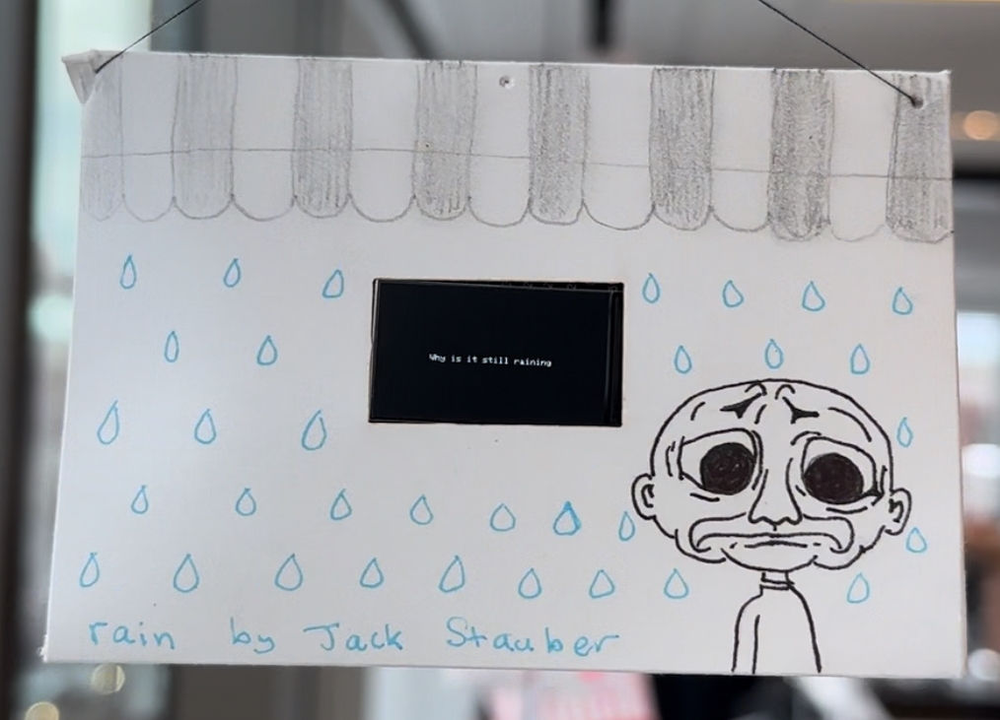

# esp32-stauber-rain
Digital art installation inspired by and using the text of Jack Stauber's "rain". 

Link to video: https://www.youtube.com/watch?v=osxJ5-_Ccp0

### Code to Device

To prepare device for installation, flash the code here written for the TTGO T1 display to a ESP32 by running it on the Arduino IDE and connecting the device to a computer using a USB-C cable.

### Suspension Setup:

Tie a string around a popsicle stick with a hole punched in it for suspending the device from an elevated place. Cut a hole the size of the TTGO T1 display in a small envelope and punch holes in the sides for string to be threaded through. Customize the envelope as desired.

### Power Connection

Solder and crimp an attachment connector in order to link a battery to the device. Insulate the crimping by adding heat shrink to the connector, ensuring a safe connection to the battery.

Power the device by connecting it to a battery (here we used a 130mAh battery, anticipating a runtime of under 2 hours with the display at full power).

### Activation:

Plug in the adapter to the ESP32 to successfully power it on.

## More Information

Please see the following site for further artistic documentation: 
https://ecommisso.github.io/creative-embedded-systems/module1.html
